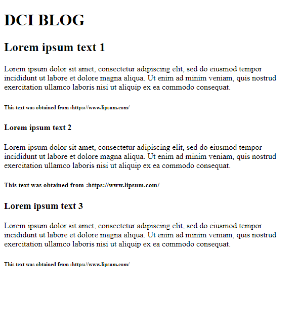

# New HTML page
## Write a new HTML page using the tags &lt;p&gt; and &lt;h1&gt; to &lt;h6&gt;. 

* The page should look like the one on the following image:
 
* The text to write is :  
Lorem ipsum dolor sit amet, consectetur adipiscing elit, sed do eiusmod tempor incididunt ut labore et dolore magna aliqua. Ut enim ad minim veniam, quis nostrud exercitation ullamco laboris nisi ut aliquip ex ea commodo consequat. 
and the reference: https://www.lipsum.com/ 

**See the image for reference**